```python
import pandas as pd
import numpy as np
from IPython.display import display
import matplotlib.pyplot as plt
import seaborn as sns
from sklearn.metrics import confusion_matrix, auc, roc_curve, precision_recall_curve
pd.set_option("display.max_columns", None)

def performances_hard_decision(y_test, y_proba, threshold_of_interest=0.5, youden=False):
    
    fpr, tpr, thresholds = roc_curve(y_test, y_proba)
    roc_auc = auc(fpr, tpr)

    precision, recall, _ = precision_recall_curve(y_test, y_proba)
    pr_auc = auc(recall, precision)
    
    if(youden):
        threshold_of_interest = thresholds[np.argmax(tpr - fpr)]
    
    y_pred = y_proba >= threshold_of_interest
    
    tn, fp, fn, tp = confusion_matrix(y_test, y_pred).ravel()

    ppv = tp / (tp+fp)
    sensitivity = tp / (tp+fn)
    specificity = tn / (tn+fp)
    npv = tn / (tn+fn)
    accuracy = (tp+tn) / (tp+tn+fp+fn)
    f1 = (2 * ppv * sensitivity) / (ppv + sensitivity)
    
    return specificity, sensitivity, ppv, npv, f1, accuracy, threshold_of_interest, roc_auc, pr_auc, fpr, tpr, precision, recall

def plot_roc_curve(x, y, data, mean, std):
    x = np.array(data[x]).reshape(-1, 100)
    y = np.array(data[y]).reshape(-1, 100)
    
    mean_tpr = y.mean(axis=0).reshape(-1)
    mean_tpr[-1] = 1.0
    mean_fpr = x.mean(axis=0).reshape(-1)

    fig, ax = plt.subplots(1, 1, figsize=(10, 10))
    plt.grid()
    # sns.lineplot(x=x, y=y, data=data, ax=ax, label=f'AUROC = {mean:.2f} $\pm$ {std:.2f}')
    ax.plot(mean_fpr, mean_tpr, label=f'AUROC = {mean:.2f} $\pm$ {std:.2f}')
    plt.xlabel("1 - Specificity")
    plt.ylabel("Sensitivity")
    
    std_tpr = y.std(axis=0)
    tprs_upper = np.minimum(mean_tpr + std_tpr, 1)
    tprs_lower = np.maximum(mean_tpr - std_tpr, 0)
    ax.fill_between(
        mean_fpr,
        tprs_lower,
        tprs_upper,
        color="grey",
        alpha=0.2,
        label=r"$\pm$ 1 std. dev.",
    )
    
    ax.plot([0, 1], [0, 1], linestyle="--", lw=2, color="r", label="Chance", alpha=0.8)
    plt.legend()
    plt.show()

def plot_prc_curve(x, y, data, mean, std):
    x = np.array(data[x]).reshape(-1, 100)
    y = np.array(data[y]).reshape(-1, 100)
    
    mean_tpr = y.mean(axis=0).reshape(-1)
    mean_tpr[-1] = 0
    mean_fpr = x.mean(axis=0).reshape(-1)

    fig, ax = plt.subplots(1, 1, figsize=(10, 10))
    plt.grid()
    # sns.lineplot(x=x, y=y, data=data, ax=ax, label=f'AUROC = {mean:.2f} $\pm$ {std:.2f}')
    ax.plot(mean_fpr, mean_tpr, label=f'AUPRC = {mean:.2f} $\pm$ {std:.2f}')
    plt.xlabel("Recall")
    plt.ylabel("Precision")
    
    std_tpr = y.std(axis=0)
    tprs_upper = np.minimum(mean_tpr + std_tpr, 1)
    tprs_lower = np.maximum(mean_tpr - std_tpr, 0)
    ax.fill_between(
        mean_fpr,
        tprs_lower,
        tprs_upper,
        color="grey",
        alpha=0.2,
        label=r"$\pm$ 1 std. dev.",
    )
    plt.legend()
    plt.show()
```


```python
from sklearn.utils import resample
from sklearn.linear_model import LogisticRegression

def cutoff_analysis(X, y, data, youden=True, file_nm='threshold'):
    n_iteration = 1000
    test_size = 0.3
    n_size = int(len(data) * test_size)

    data = data[[X, y]].values

    # run bootstrap
    stats_specificity = list()
    stats_sensitivity = list()
    stats_ppv = list()
    stats_npv = list()
    stats_f1 = list()
    stats_accuracy = list()
    stats_threshold = list()
    stats_threshold_per = list()
    stats_auroc = list()
    stats_auprc = list()
    
    fig_fpr = list()
    fig_tpr = list()
    fig_precision = list()
    fig_recall = list()
    
    mean_fpr = np.linspace(0, 1, 100)
    mean_recall = np.linspace(0, 1, 100)
    
    for i in range(n_iteration):
        train = resample(data, n_samples=n_size, stratify=data[:, -1])
        test = np.array([x for x in data if x.tolist() not in train.tolist()])
        
        model = LogisticRegression()
        model.fit(train[:, :-1], train[:, -1])
        
        y_hat_test = model.predict_proba(test[:, :-1])
        specificity, sensitivity, ppv, npv, f1, accuracy, threshold_of_interest, roc_auc, pr_auc, fpr, tpr, precision, recall = performances_hard_decision(test[:, -1], y_hat_test[:, 1], youden=youden)
        
        threshold = ((np.log(threshold_of_interest/(1-threshold_of_interest)) - model.intercept_) /model.coef_)[0][0]
        
        stats_specificity.append(specificity)
        stats_sensitivity.append(sensitivity)
        stats_ppv.append(ppv)
        stats_npv.append(npv)
        stats_f1.append(f1)
        stats_accuracy.append(accuracy)
        stats_threshold.append(threshold)
        stats_threshold_per.append(threshold_of_interest)
        stats_auprc.append(pr_auc)
        stats_auroc.append(roc_auc)
        
        interp_tpr = np.interp(mean_fpr, fpr, tpr)
        interp_tpr[0] = 0.0
        
        interp_precision = np.interp(mean_recall, np.flip(recall), np.flip(precision))
        # interp_precision[0] = 1.0
        
        fig_fpr.extend(mean_fpr.tolist())
        fig_tpr.extend(interp_tpr.tolist())
        fig_precision.extend(interp_precision.tolist())
        fig_recall.extend(mean_recall.tolist())
        
    metrics = {'specificity':stats_specificity, 'sensitivity':stats_sensitivity, 
                'ppv':stats_ppv, 'npv':stats_npv, 'f1':stats_f1, 'accuracy':stats_accuracy, 
                'threshold':stats_threshold, 'threshold_per':stats_threshold_per, 
                'auprc':stats_auprc, 'auroc':stats_auroc}
    
    pd.DataFrame(metrics).to_csv('../result/' + file_nm, encoding='utf-8-sig', index=False)
    
    for name, metric in metrics.items():
        mean = np.mean(metric)
        alpha = 0.95
        p = ((1.0-alpha)/2.0) * 100
        lower = max(0.0, np.percentile(metric, p))
        p = (alpha+((1.0-alpha)/2.0)) * 100
        if name == 'threshold':
            upper = max(1.0, np.percentile(metric, p))
        else: 
            upper = min(1.0, np.percentile(metric, p))
        print(f'Mean {name} = {mean:.2f}, {alpha*100:.0f}% confidence interval {lower:3.2f} and {upper:3.2f}')
    
    fig_auroc = pd.DataFrame({'fpr':fig_fpr, 'tpr':fig_tpr})
    fig_auprc = pd.DataFrame({'precision':fig_precision, 'recall':fig_recall})
    
    plot_roc_curve(x='fpr', y='tpr' , data=fig_auroc, mean=np.mean(stats_auroc), std=np.std(stats_auroc))
    plot_prc_curve(x='recall', y='precision' , data=fig_auprc, mean=np.mean(stats_auprc), std=np.std(stats_auprc))

def test_plot(x, y):
    fig, ax = plt.subplots(1, 1, figsize=(10, 10))
    plt.grid()
    # sns.lineplot(x=x, y=y, data=data, ax=ax, label=f'AUROC = {mean:.2f} $\pm$ {std:.2f}')
    ax.plot(x, y)
    plt.xlabel("Recall")
    plt.ylabel("Precision")
    plt.show()
```


```python
if __name__ == '__main__':
    
    # df_orig = pd.read_excel('../data/20210913 ISE-FENO eos.xlsx', 
    #                         sheet_name='669 (77 missing eos제외)')
    df_orig = pd.read_csv('../../DB/data/ISE_3_cut_dataset.csv')
    
    print('Blood Eosinophil Counts')
    cutoff_analysis(X='Lab_EosCount', y='ISE_Eo3%', data=df_orig, youden=True, file_nm='bl_cut.csv')

    print('\nFeNO')
    cutoff_analysis(X='FeNO', y='ISE_Eo3%', data=df_orig, youden=True, file_nm='feno_cut.csv')
```

    Blood Eosinophil Counts
    Mean specificity = 0.74, 95% confidence interval 0.69 and 0.86
    Mean sensitivity = 0.80, 95% confidence interval 0.67 and 0.84
    Mean ppv = 0.67, 95% confidence interval 0.64 and 0.76
    Mean npv = 0.85, 95% confidence interval 0.80 and 0.87
    Mean f1 = 0.73, 95% confidence interval 0.70 and 0.75
    Mean accuracy = 0.76, 95% confidence interval 0.74 and 0.79
    Mean threshold = 200.58, 95% confidence interval 184.04 and 290.00
    Mean threshold_per = 0.29, 95% confidence interval 0.24 and 0.44
    Mean auprc = 0.77, 95% confidence interval 0.74 and 0.79
    Mean auroc = 0.83, 95% confidence interval 0.81 and 0.85


    
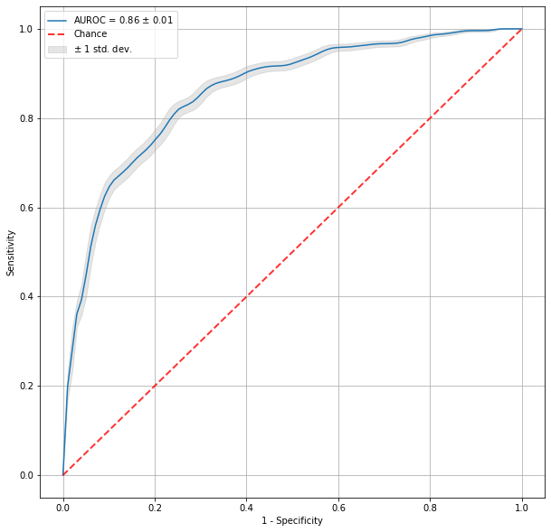
    


    
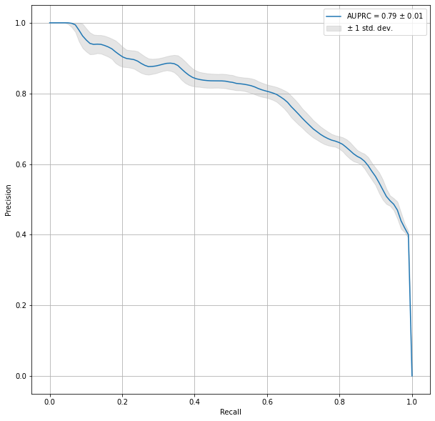
    


    
    FeNO
    Mean specificity = 0.82, 95% confidence interval 0.67 and 0.93
    Mean sensitivity = 0.56, 95% confidence interval 0.38 and 0.72
    Mean ppv = 0.90, 95% confidence interval 0.85 and 0.95
    Mean npv = 0.39, 95% confidence interval 0.27 and 0.56
    Mean f1 = 0.68, 95% confidence interval 0.54 and 0.79
    Mean accuracy = 0.62, 95% confidence interval 0.49 and 0.73
    Mean threshold = 89.16, 95% confidence interval 66.00 and 114.03
    Mean threshold_per = 0.81, 95% confidence interval 0.59 and 0.97
    Mean auprc = 0.87, 95% confidence interval 0.84 and 0.91
    Mean auroc = 0.67, 95% confidence interval 0.56 and 0.77


    
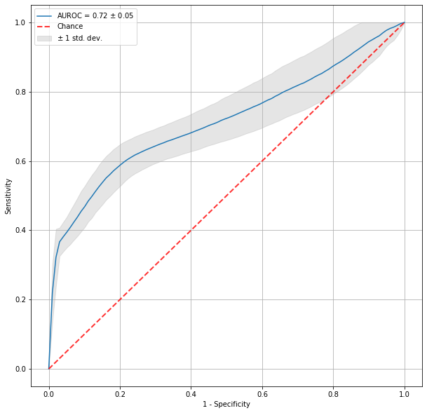
    


    
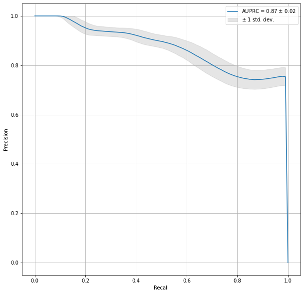
    


```python
    print(df_orig.query('Asthma == 1')['ISE_Eo3%'].value_counts())
    print('\nBlood Eosinophil Counts')
    cutoff_analysis(X='Lab_EosCount', y='ISE_Eo3%', data=df_orig.query('Asthma == 1'), youden=True, file_nm='bl_cut_sub_a.csv')

    print('\nFeNO')
    cutoff_analysis(X='FeNO', y='ISE_Eo3%', data=df_orig.query('Asthma == 1'), youden=True, file_nm='feno_cut_sub_a.csv')
    
    print(df_orig.query('Asthma == 0')['ISE_Eo3%'].value_counts())
    
    print('\nBlood Eosinophil Counts')
    cutoff_analysis(X='Lab_EosCount', y='ISE_Eo3%', data=df_orig.query('Asthma == 0'), youden=True, file_nm='bl_cut_sub_h.csv')

    print('\nFeNO')
    cutoff_analysis(X='FeNO', y='ISE_Eo3%', data=df_orig.query('Asthma == 0'), youden=True, file_nm='feno_cut_sub_h.csv')
```

    1    375
    0    137
    Name: ISE_Eo3%, dtype: int64
    
    Blood Eosinophil Counts
    Mean specificity = 0.82, 95% confidence interval 0.69 and 0.88
    Mean sensitivity = 0.75, 95% confidence interval 0.68 and 0.86
    Mean ppv = 0.91, 95% confidence interval 0.88 and 0.94
    Mean npv = 0.56, 95% confidence interval 0.50 and 0.66
    Mean f1 = 0.82, 95% confidence interval 0.78 and 0.87
    Mean accuracy = 0.77, 95% confidence interval 0.73 and 0.82
    Mean threshold = 260.34, 95% confidence interval 188.16 and 289.00
    Mean threshold_per = 0.70, 95% confidence interval 0.54 and 0.82
    Mean auprc = 0.91, 95% confidence interval 0.90 and 0.93
    Mean auroc = 0.83, 95% confidence interval 0.80 and 0.86


    
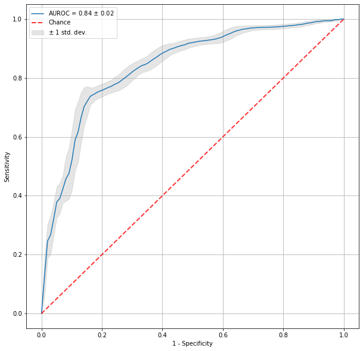
    


    
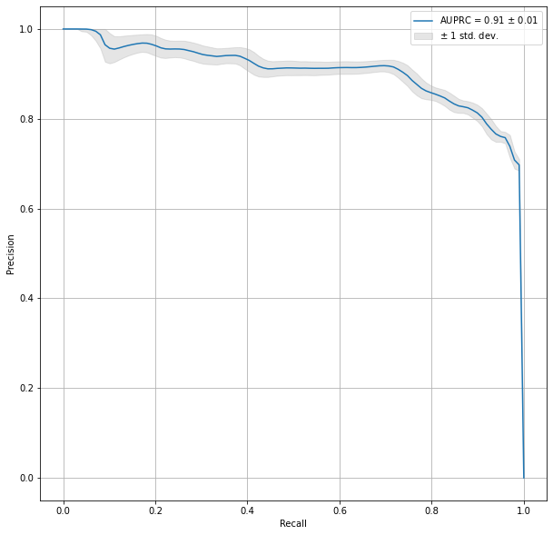
    


    
    FeNO
    Mean specificity = 0.81, 95% confidence interval 0.67 and 0.91
    Mean sensitivity = 0.72, 95% confidence interval 0.58 and 0.86
    Mean ppv = 0.92, 95% confidence interval 0.87 and 0.95
    Mean npv = 0.51, 95% confidence interval 0.39 and 0.67
    Mean f1 = 0.80, 95% confidence interval 0.71 and 0.88
    Mean accuracy = 0.74, 95% confidence interval 0.65 and 0.83
    Mean threshold = 62.18, 95% confidence interval 41.00 and 78.00
    Mean threshold_per = 0.76, 95% confidence interval 0.58 and 0.92
    Mean auprc = 0.92, 95% confidence interval 0.90 and 0.94
    Mean auroc = 0.80, 95% confidence interval 0.74 and 0.85


    
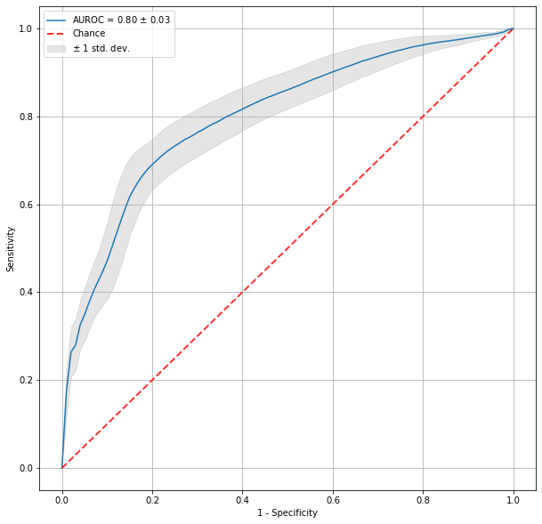
    


    
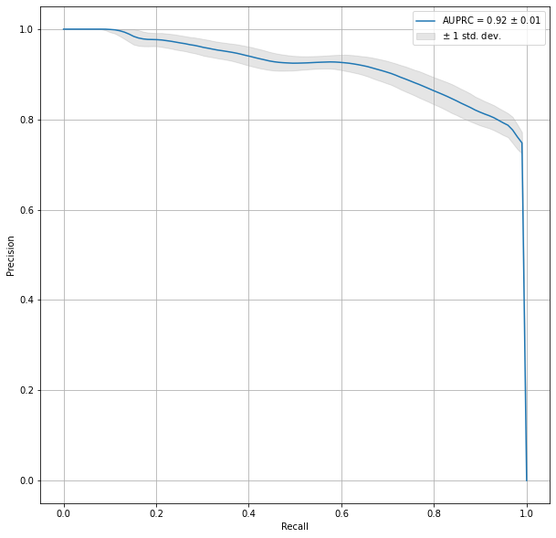
    


    0    772
    1    143
    Name: ISE_Eo3%, dtype: int64
    
    Blood Eosinophil Counts
    Mean specificity = 0.71, 95% confidence interval 0.63 and 0.76
    Mean sensitivity = 0.76, 95% confidence interval 0.70 and 0.84
    Mean ppv = 0.38, 95% confidence interval 0.33 and 0.43
    Mean npv = 0.93, 95% confidence interval 0.91 and 0.95
    Mean f1 = 0.50, 95% confidence interval 0.46 and 0.55
    Mean accuracy = 0.72, 95% confidence interval 0.67 and 0.76
    Mean threshold = 183.11, 95% confidence interval 157.32 and 209.76
    Mean threshold_per = 0.13, 95% confidence interval 0.10 and 0.16
    Mean auprc = 0.46, 95% confidence interval 0.40 and 0.51
    Mean auroc = 0.78, 95% confidence interval 0.75 and 0.81


    
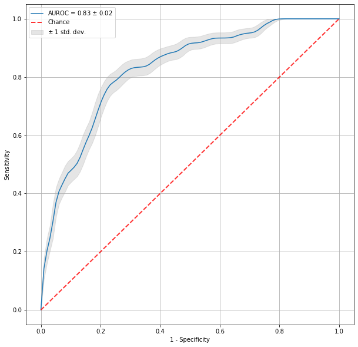
    


    
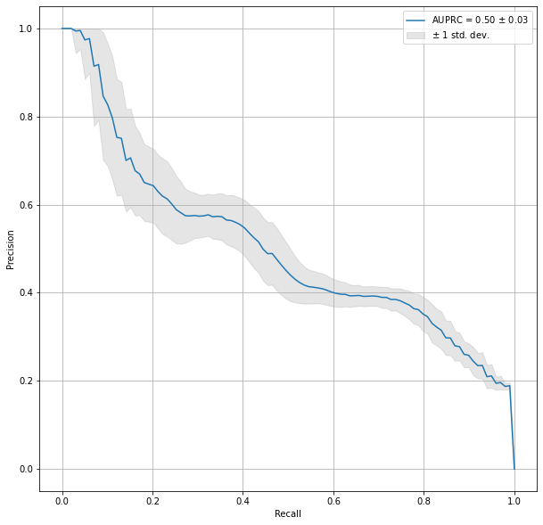
    


    
    FeNO
    Mean specificity = 0.78, 95% confidence interval 0.13 and 0.98
    Mean sensitivity = 0.39, 95% confidence interval 0.14 and 1.00
    Mean ppv = 0.77, 95% confidence interval 0.57 and 0.92
    Mean npv = 0.56, 95% confidence interval 0.37 and 1.00
    Mean f1 = 0.44, 95% confidence interval 0.25 and 0.81
    Mean accuracy = 0.56, 95% confidence interval 0.44 and 0.70
    Mean threshold = 75.47, 95% confidence interval 5.00 and 112.00
    Mean threshold_per = 0.49, 95% confidence interval 0.05 and 0.84
    Mean auprc = 0.59, 95% confidence interval 0.50 and 0.68
    Mean auroc = 0.44, 95% confidence interval 0.30 and 0.57


    
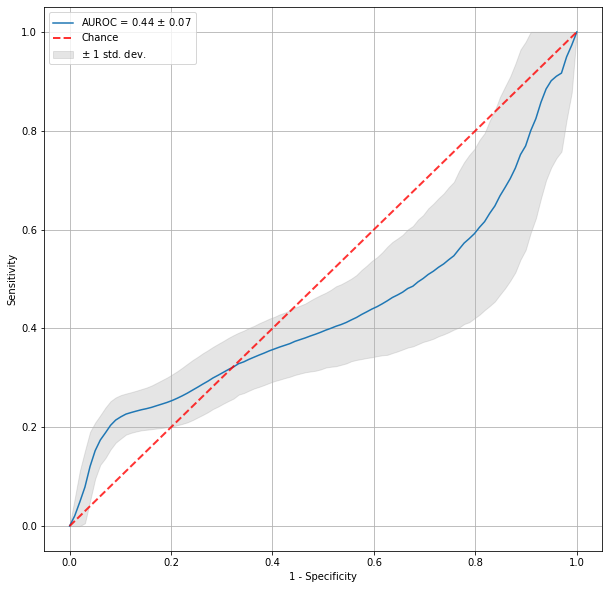
    


    
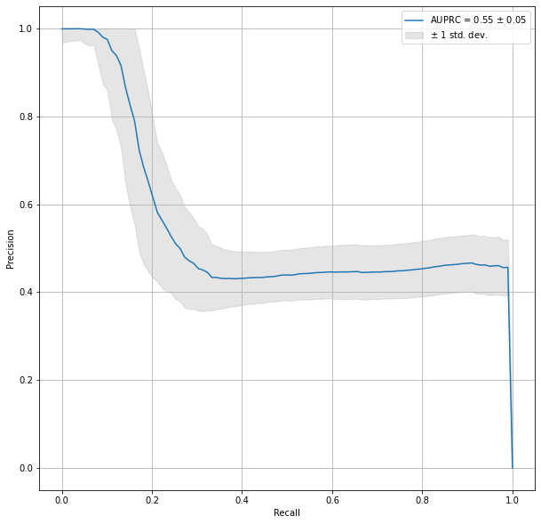
    

